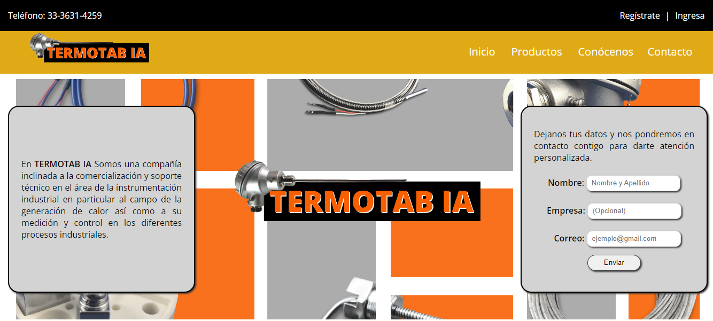
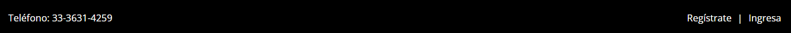
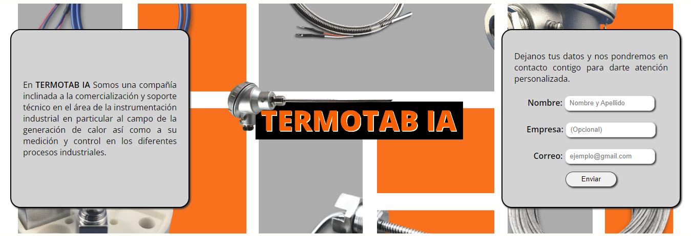
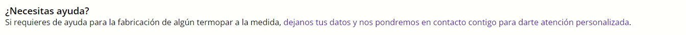
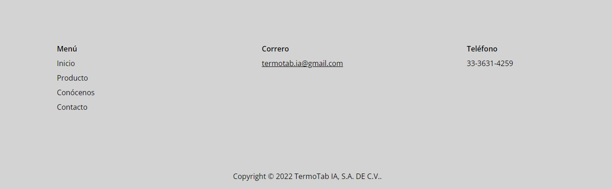

# Landing (TERMOTAB IA)

Esta página Landing está dividida en 7 secciones:
- <a href="#top"> Top. </a>
- <a href="#nav"> Navegación. </a>
- <a href="#jumbo"> Jumbotrón. </a>
- <a href="#cat"> Catálogos. </a>
- <a href="#art"> Artículo. </a>
- <a href="#soc"> Social. </a>
- <a href="#foo"> Footer. </a>

Esta página sólo muestra el Landing, no te va llevar a ningún otro lado y el formulario tampoco funciona (aún). 

La página es responsiva, adaptable a tamaño computadora e inferior (Los resultados en pantalla superior a un monitor estandar son desconocidos).

---
## 
 Top 

La sección **Top** es la barra superior de color negro, a la izquierda muestra un teléfono de contacto; a la derecha muestra la sección para ingresar o registrarte a la página. Esta parte de la derecha cuenta con un hover que cambia de color las letras.

---
## 
 Navegación 

La **Navegación** muetra un logo del lado izquierdo; del lado derecho muestra un pool de opciones a forma de menú de navegación, estas opciones cuentan con un hover que les cambia el color de letra y les pone un borde inferior.

Está sección de **Navegación** se encuentra dentro del contenido principal debido a que tiene la propiedad *sticky* y al colocar la **Navegación** en el *header* esta propiedad no funcionaba como se requería.

---
## 
 Jumbotrón 

El jumbotrón en el lado izquierdo tiene una pequeña descripción de lo qué es la empresa, por la derecha se encuentra un pequeño formulario para poder recopilar información de clientes potenciales. El botón de *Enviar* tiene un efecto cuando se situa el cursor ahí.

---
## 
 Catálogos 

---
## 
 Artículo 

El **Artículo** es un pequeño texto para ofrecer atención personalizada al cliente, este artículo está linkeado hacia el formulario para que el cliente pueda dejar sus datos y posteriormente se comuniquen con él de forma persolanizada.

---
## 
 Social 

La sección **Social** muestra las redes, cada icono se colorea cuando das click o pasas el cursor por encima

---
## 
 Footer 

El **Footer** inclye el menú de navegación e información de contacto como lo es el correo y el teléfono. En la parte inferior del **Footer** se muestran los derechos.

